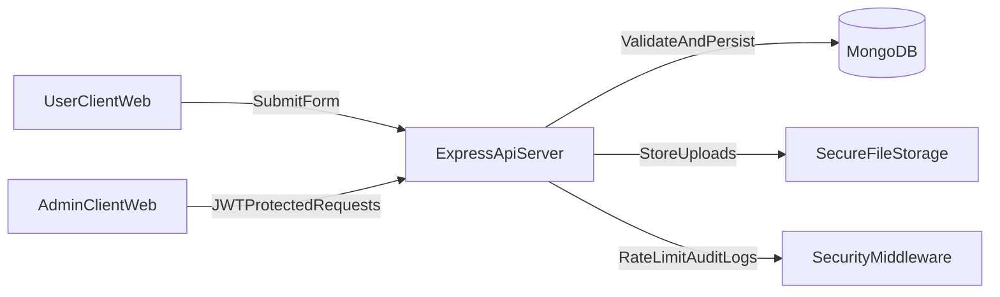

# Full-Stack UI/UX + Security Enhancement Plan

## Scope

Upgrade this project into a modern, interactive, and secure app with:

- web-first UI library stack (React Native-like UX on web)
- polished animations and responsive design
- real backend with MongoDB
- authentication + protected admin workflows
- validation, file handling, and security hardening

## Architecture Direction

- **Frontend**: Keep React + Vite, migrate UI to Tailwind + component library patterns and animation utilities.
- **Backend**: Add Node.js + Express API with MongoDB and JWT auth.
- **Data flow**: Frontend submits forms to secure API; admin reads/updates via authenticated endpoints.

## Phase 1: Foundation + Tooling

- Add monorepo-like structure:
  - `frontend/` (existing app migrated)
  - `backend/` (new Express service)
- Move current app files into frontend app with minimal breakage first.
- Add env management templates:
  - `frontend/.env.example`
  - `backend/.env.example`
- Backend envs to define:
  - `PORT`
  - `MONGODB_URI`
  - `JWT_SECRET`
  - `JWT_EXPIRES_IN`
  - `CORS_ORIGIN`
  - `RATE_LIMIT_WINDOW_MS`
  - `RATE_LIMIT_MAX`
  - `UPLOAD_MAX_MB`
  - `NODE_ENV`
- Add baseline scripts at root (or workspace-level docs) for running both services.
- Keep current app functional before full migration to avoid long downtime.

## Phase 2: Backend API + Security

- Create backend structure:
  - `backend/src/app.ts`
  - `backend/src/server.ts`
  - `backend/src/config/`
  - `backend/src/modules/{auth,submissions,uploads,health}/`
  - `backend/src/middleware/`
- Implement MongoDB models:
  - `User` (admin, hashed password, role, audit fields)
  - `LifeHistorySubmission`
  - `SocialSecuritySubmission`
- Implement auth:
  - Admin login endpoint (`POST /api/auth/login`)
  - JWT issue/verify middleware
  - Role-based route guard for admin routes
- Security middleware baseline:
  - `helmet`
  - CORS whitelist
  - rate limiting (global + auth endpoints)
  - payload size limits
  - request sanitization + safe validation
- Input validation:
  - Use `zod` or `joi` schemas for all request bodies
  - Return consistent typed error responses
- File upload security:
  - MIME/type checks
  - file-size checks
  - generated safe filenames
  - optional image transform/compression
- Audit-friendly logging:
  - request id + structured logs
  - auth failures and status-change events

## Phase 3: Frontend Modern UI Overhaul

- Keep React + Vite and move to web-first modern stack:
  - Tailwind CSS
  - headless accessible primitives (e.g. Radix-based patterns)
  - icon set (e.g. lucide-react)
  - motion library (Framer Motion)
- Replace large CSS files incrementally:
  - Start with `Home`, top nav, and shared layout primitives
  - Build reusable tokens/components: buttons, cards, badges, inputs, alerts, modals
- Add global UI polish:
  - responsive spacing scale
  - typography hierarchy
  - better color contrast
  - dark-mode-ready theme tokens (optional toggle)
- Add interaction upgrades:
  - animated section reveals
  - hover/focus micro-interactions
  - loading skeletons/spinners
  - submit success/error toast notifications

## Phase 4: Forms UX, Validation, and Reliability

- Refactor forms into smaller reusable sections/components.
- Add schema-based client validation (shared with backend if possible).
- Improve field UX:
  - inline validation
  - clear required markers
  - contextual helper text
  - better date and phone inputs
- Add auto-save draft (local storage) with restore prompt.
- Submission reliability:
  - retry strategy for transient failures
  - disabled state and progress UI while submitting
  - normalized API error display
- Accessibility pass:
  - labels and aria attributes
  - keyboard navigation
  - focus states and error announcement semantics

## Phase 5: Admin Experience + Protected Workflows

- Convert current admin panel to authenticated workflow:
  - login page + token storage strategy
  - protected route wrapper
- Upgrade admin table/list:
  - filter by status/form type/date
  - quick search by employee name/id
  - pagination
  - sort controls
- Detail view enhancements:
  - side panel or modal
  - timeline/status history
  - approve/reject with optional reason
- Export enhancements:
  - JSON export (existing)
  - CSV export for filtered results

## Phase 6: Quality, Testing, and Production Readiness

- Frontend tests:
  - component tests for key form sections
  - route protection tests
- Backend tests:
  - auth middleware tests
  - submission endpoint integration tests
  - validation failure coverage
- Add lint/typecheck/test scripts for both apps and root shortcuts.
- Add docs:
  - local development
  - env setup
  - deployment notes
  - security checklist

## Key Files To Touch (Initial)

- Frontend:
  - [`package.json`](package.json)
  - [`src/App.tsx`](src/App.tsx)
  - [`src/components/Home.tsx`](src/components/Home.tsx)
  - [`src/components/LifeHistoryForm.tsx`](src/components/LifeHistoryForm.tsx)
  - [`src/components/SocialSecurityForm.tsx`](src/components/SocialSecurityForm.tsx)
  - [`src/components/AdminPanel.tsx`](src/components/AdminPanel.tsx)
  - [`src/services/formSubmission.ts`](src/services/formSubmission.ts)
- Backend (new):
  - [`backend/src/server.ts`](backend/src/server.ts)
  - [`backend/src/app.ts`](backend/src/app.ts)
  - [`backend/src/modules/auth/`](backend/src/modules/auth/)
  - [`backend/src/modules/submissions/`](backend/src/modules/submissions/)

## Execution Order

1. Scaffold backend with secure defaults and health endpoint.
2. Add auth + submission endpoints with MongoDB persistence.
3. Wire frontend service layer from localStorage to API.
4. Migrate UI to Tailwind + interactive components page-by-page.
5. Harden admin workflows and finalize testing/docs.